# ☕ Siap Nyafe - Modern Coffee Shop Management System

**Siap Nyafe** is a state-of-the-art, web-based Point of Sale (POS) and Management System designed specifically for modern coffee shops. Built with a high-performance **Spring Boot** backend and a dynamic **React** frontend, it features a distinctive **Neo-Brutalist** design language that sets it apart from generic management tools.


---

## 📸 Application Showcase

Explore the comprehensive features of **Siap Nyafe** through our gallery.

| | |
|:---:|:---:|
| 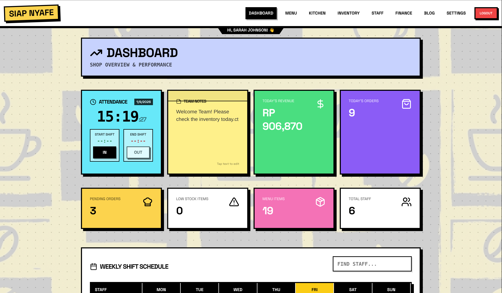<br>**Dashboard** | 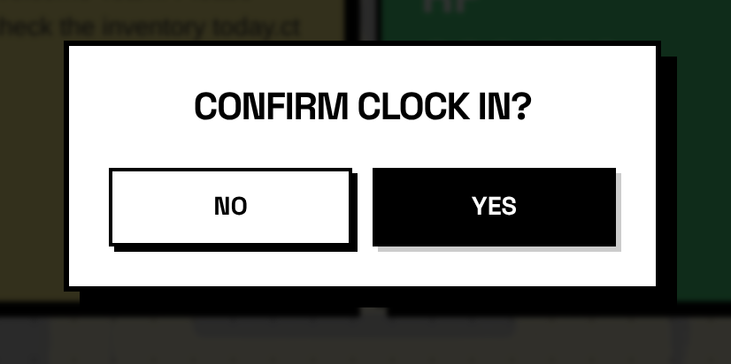<br>**Mobile / Menu Detail** |
| 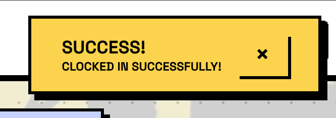<br>**Cart / Order Summary** | 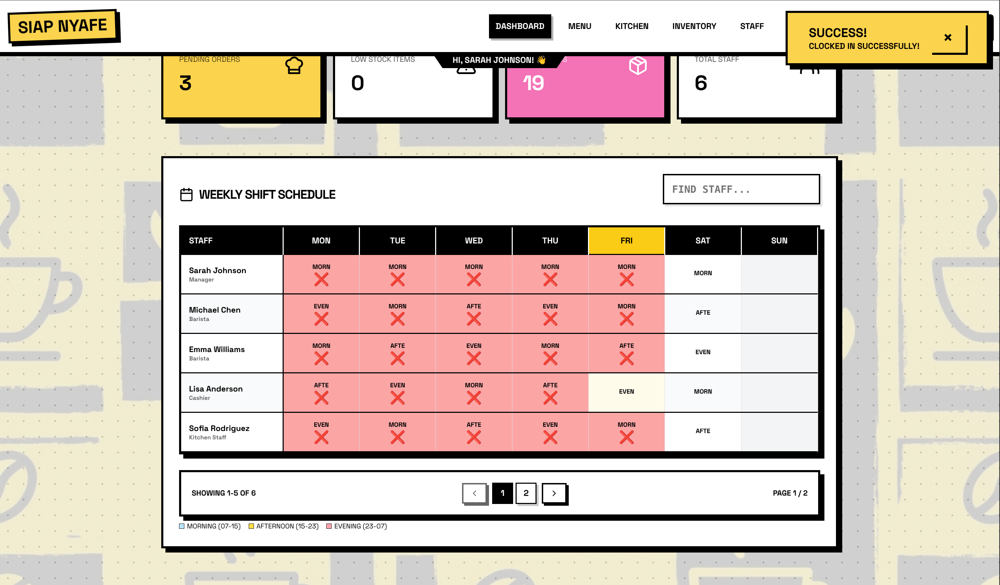<br>**Customer Order View** |
| 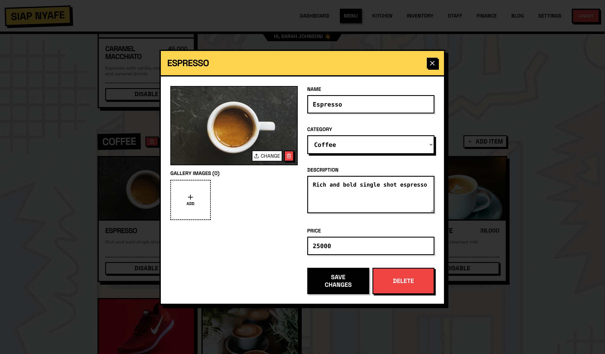<br>**Kitchen Display System (KDS)** | 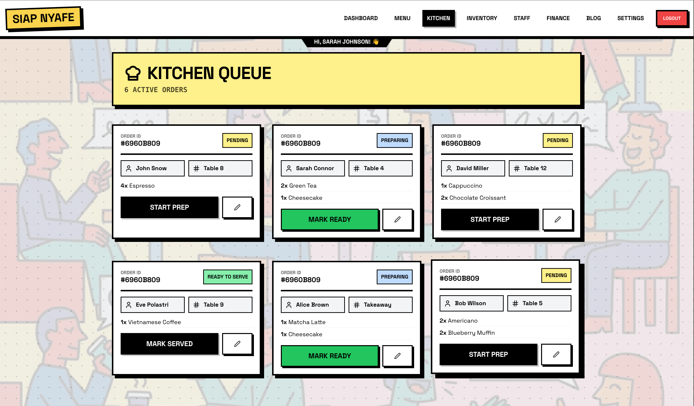<br>**Manager Dashboard Overview** |
| 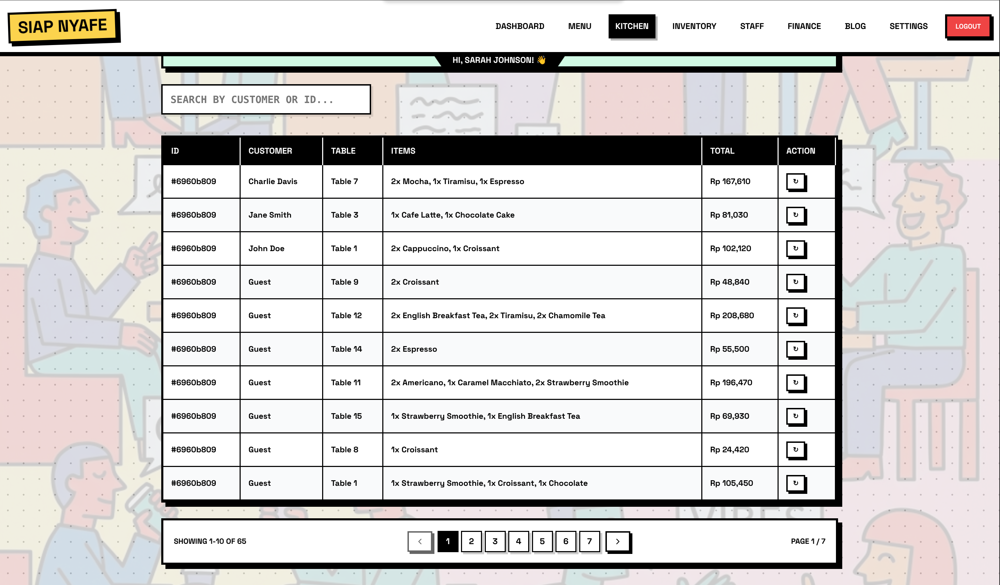<br>**Real-time Statistics** | 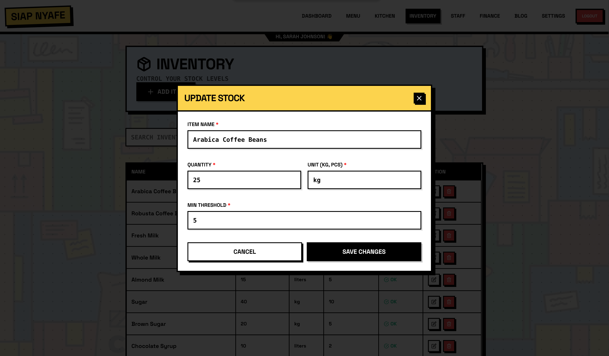<br>**Menu Management (CMS)** |
| 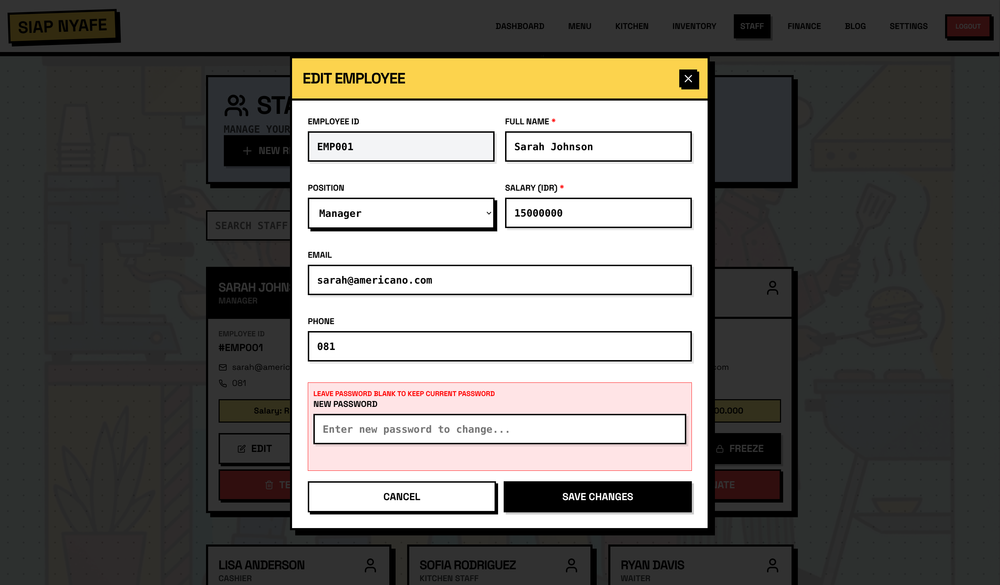<br>**Inventory Tracking** | 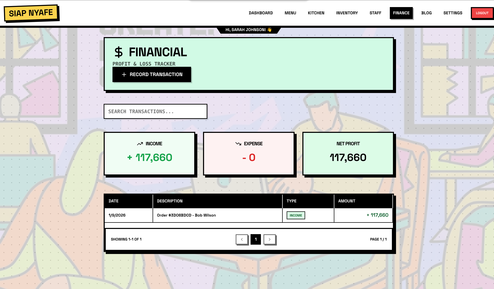<br>**Staff & Shift Management** |
| 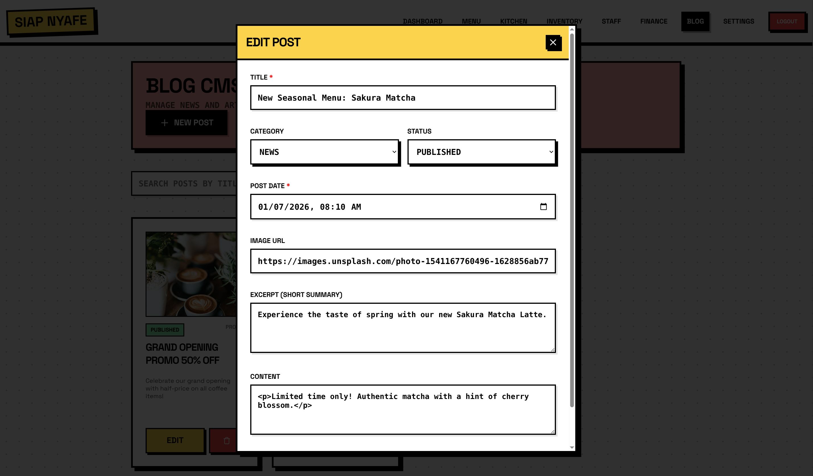<br>**Finance & Transactions** | 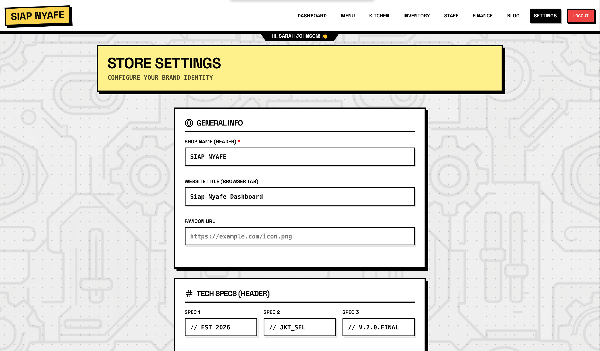<br>**Blog / Post Management** |
| 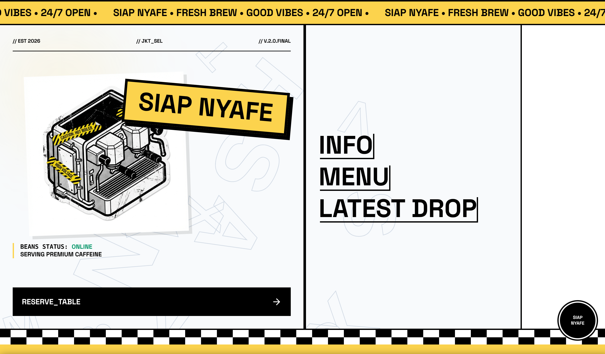<br>**Shop Settings** | 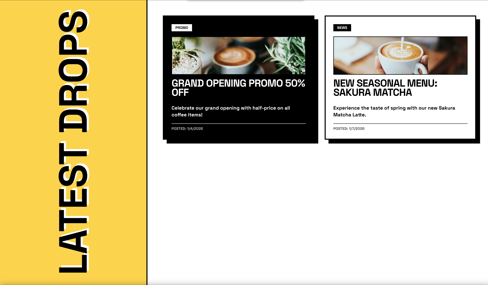<br>**Order History** |
| 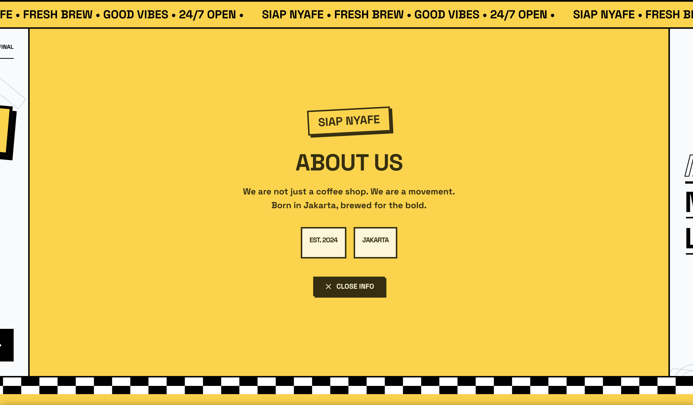<br>**Detail View** | 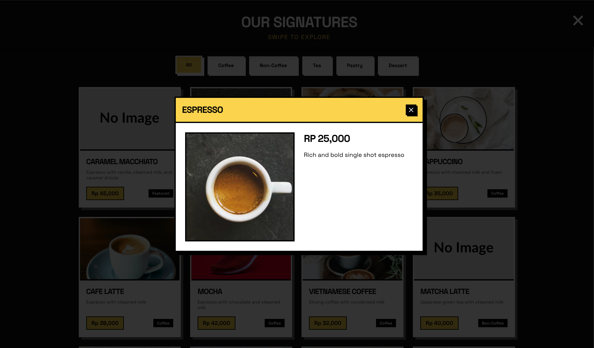<br>**Edit Modal / Form** |
| 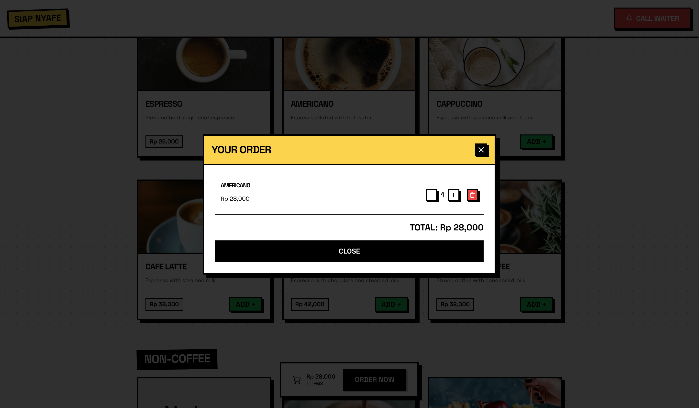<br>**System Configuration** | 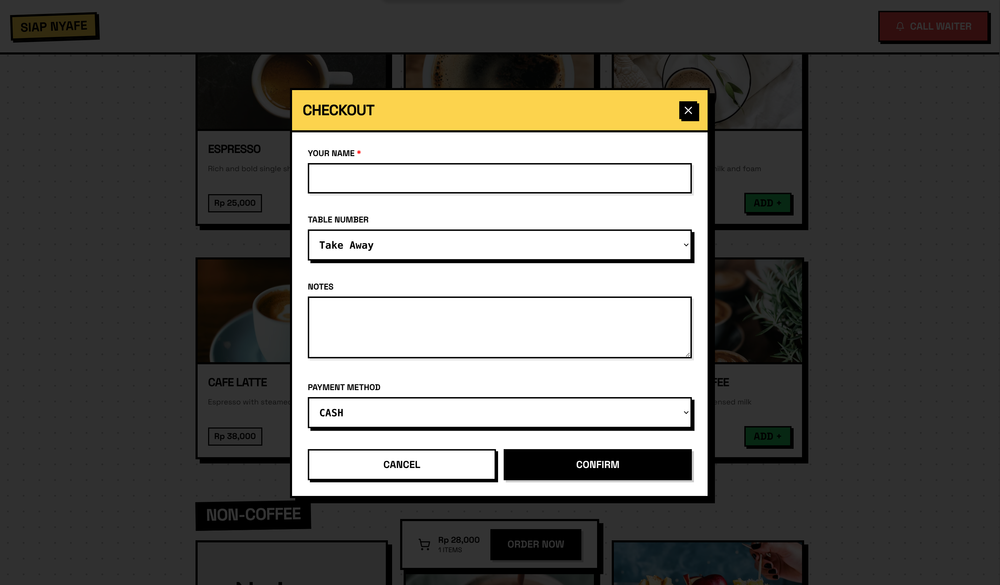<br>**User Profile** |
| 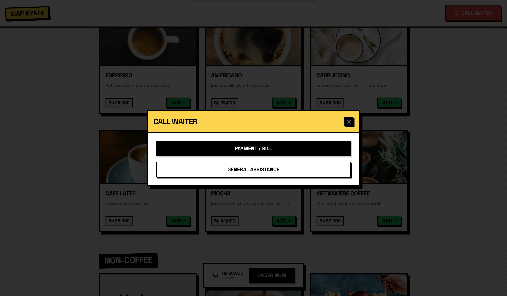<br>**Mobile Responsive View** | |

---

## 🚀 Features Overview

### 🛒 Customer Experience (Ordering)
*   **Visual Menu**: Beautiful card-based layout with category filtering (Coffee, Non-Coffee, Snacks).
*   **Smart Cart**: Easy-to-use cart with quantity adjustments and special instruction fields.
*   **Self-Service**: Customers can input their name and table number directly.
*   **Payment Integration**: Options for Cash, QRIS, and Card payments.

### 👨‍🍳 Kitchen Display System (KDS)
*   **Real-Time Workflow**: Orders appear instantly with status states: `PENDING` ➔ `PREPARING` ➔ `READY` ➔ `SERVED`.
*   **Digital Tickets**: Replaces paper tickets with clear, readable digital cards showing items, table, and notes.
*   **Staff Assignment**: Tracks which shift member is handling specific orders.

### 📊 Admin & Management Dashboard
*   **Dashboard Hub**: A central view with sticky notes for team communication and quick stats.
*   **Inventory Management**: Track ingredient levels, units, and low-stock alerts.
*   **Finance & Transactions**: Detailed logs of all sales and revenue tracking.
*   **Employee Hub**: Manage staff profiles, roles, and shift schedules.
*   **Menu CMS**: Effortless addition/editing of menu items, prices, and images.

---

## 🛠 Tech Stack

### Backend (API Server)
*   **Framework**: Java 21 + Spring Boot 3.2.1
*   **Database**: MongoDB
*   **Security**: Spring Security (JWT/Session)
*   **Build Tool**: Maven

### Frontend (Client App)
*   **Framework**: React.js 18
*   **Build Tool**: Vite 5
*   **Styling**: **Neo-Brutalist CSS**, Vanilla CSS modules, Lucide React Icons.
*   **Libraries**: `Axios`, `Swiper`, `React Router 6`.

---

## 📂 Project Structure

```bash
/
├── backend/                 # Spring Boot Server
│   ├── src/main/java/...   # Controllers, Services, Models
│   └── src/main/resources/ # Application Config
│
└── frontend/                # React Vite Client
    ├── src/
    │   ├── components/     # Reusable UI components
    │   ├── pages/          # Full page views
    │   └── assets/         # Images and global styles
    └── screenshots/        # Project display images
```

---

## 📦 Getting Started

### Prerequisites
*   **Java JDK 17+** (JDK 21 Recommended)
*   **Node.js 18+**
*   **MongoDB**

### 1. Backend Setup
```bash
cd backend
./mvnw spring-boot:run
```
*Server runs on `http://localhost:8080`*

### 2. Frontend Setup
```bash
cd frontend
npm install
npm run dev
```
*Client runs on `http://localhost:3000`*

---

## 👥 Authors
Developed by **Widi Firmaan** and the **Siap Nyafe Team**.
